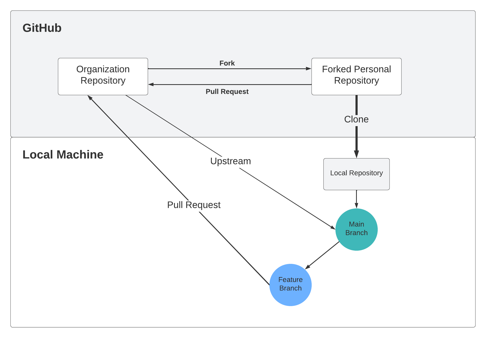

# Contribute to Other Projects

### Put it all together

This has all been a lead up to contributing to projects that are hosted in the NSCCS organization. With just a few more steps you will be able to contribute to this and any other public repository on GitHub.

### Keywords

fork - Copy of a repository that exists in your GitHub space
upstream - points to the original repository that you forked

### Contribute to a Repository on GitHub

The last concept for this workshop is called a Fork. A fork of a repository is a copy of that repository in your own GitHub space.

To make a contribution to the original project you first fork the original repository. We will use [this one](https://github.com/nsccs/ForkPracticeCareerPrep).

Then configure the upstream remote

```shell
git remote add upstream https://github.com/nsccs/ForkPracticeCareerPrep.git
# Then verify
git remote -v
```

The rest is what was previously covered:

- Clone your copied (forked) repository to your local computer
- Create a feature branch to do your work
- Create PR of your complete work from your feature branch into the upstream branch
- Anxiously await feedback



You have just made your first contribution to an open source repository!

Check the club [organization](https://github.com/nsccs) for ongoing projects that you might want to get involved with. If you have ideas please list them on Discord and invite people to contribute.