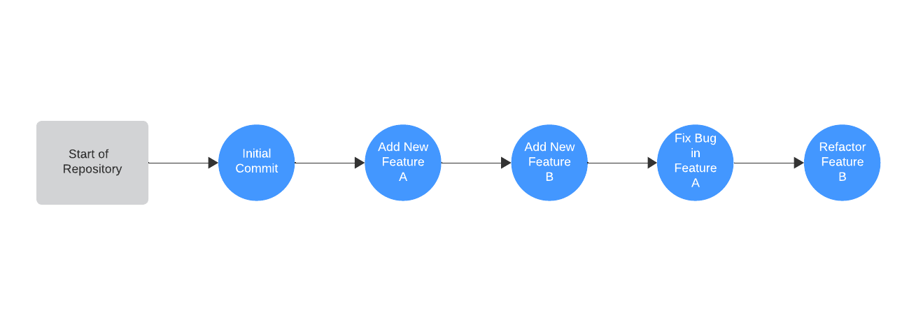

# Git Basics

### Keywords

- stage         - add a file to be committed
- commit        - The state of the repository at this point in time is saved
- checkout      - Refers to the creation or switching between branches or commits.

### Concepts

Git is a version control system that allows one or more people to manage different versions of a repository. A repository can be though of as a project directory. A repository contains documents like text, code, and configuration files as well as images. The repository, often referred to as a "repo", also contains the change history called a commit history. Each commit is a saved version of the repo at that point in time. You can think of a commit history as a series of backups.

**Basic Commit History**



### Create A Local Repository and Make a Commit

1. Mac/Linux open a terminal
2. Windows open _Git Bash_
3. Create directory
4. Navigate through the terminal to the root of the directory 
5. Type ```git init```
6. Create a file called _first-markdown.md_ and open it in your favorite text editor/IDE 
7. Write something in the file and save it 
8. In the terminal type
   1. ```git status```
   2. ```git add first-markdown.md```
   3. ```git status```
   4. ```git commit -m "Some message here about what you did."```
   5. ```git log```
   6. Repeat these steps. On each iteration attempt to new files, edit existing files, and/or delete files

TODO do a revert


### Basic Commands

```shell
git init                        Creates a new git repository
git status                      Show status of staged/unstaged files
git diff                        See changes to the file compared to most recent commit
git add <file_name>             Add file to commit (stage it)           
git commit -m "<message>"       Commit files with clear message about commit
git log                         Display a list of commits
git revert <commit id>          Revert the commit with provided id
```