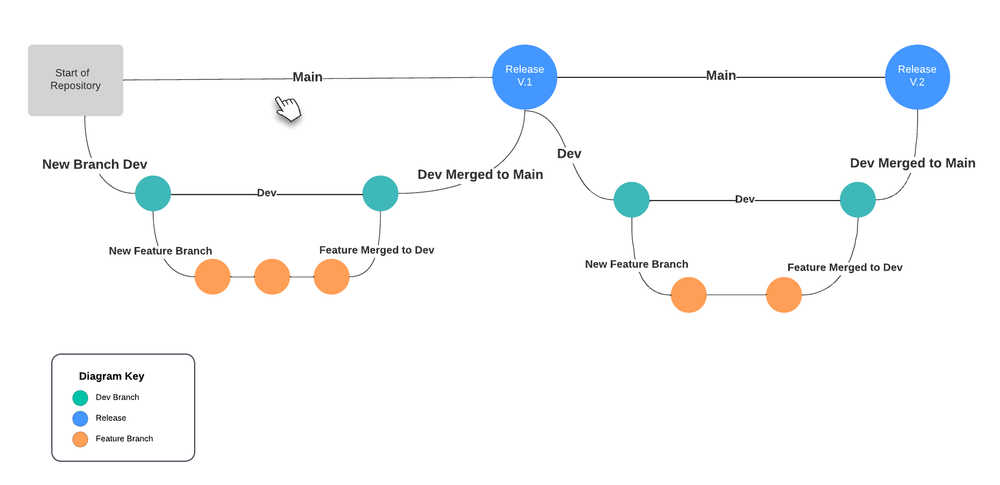
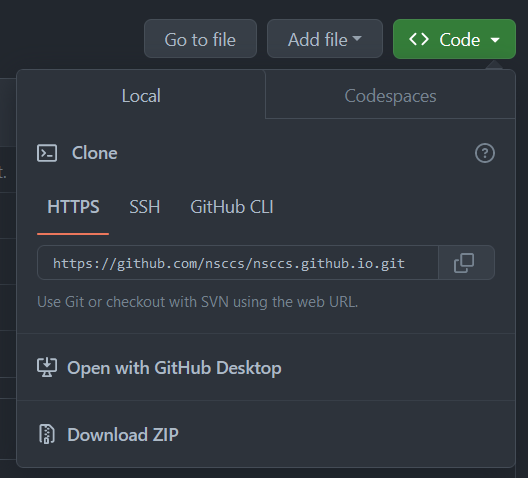
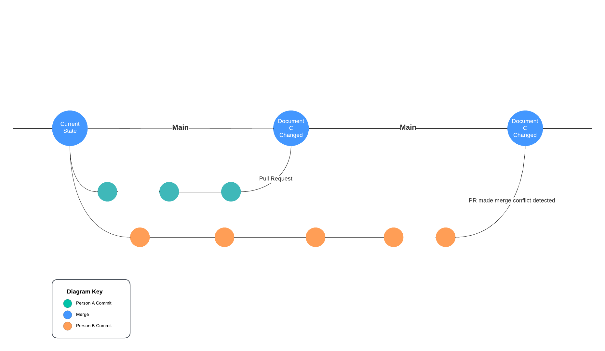

# GitHub Basics

### Keywords

- clone - Copy a repository from GitHub to your local machine
- branch - A version of the code that deviates from the branch it originated from
- Pull Request - A request to merge one branch into another
- conflict - When git cannot resolve a merge without manual intervention

### Concepts

GitHub is a place to store repositories, share them with other GitHub users, and collaborate with others on projects. GitHub involves the Git installed on your computer to host a _local_ version of the repository on your computer. When you have committed changes you will _push_ your commit history (think upload) to the GitHub platform.

**Multiple Branch Git History**



### Create a Repository on GitHub and Push a Commit

Login to GitHub then create a new repository


and give it a name, or use the suggested name, then select the option to add a _README.md_. After the repository has been created navigate to the drop-down seen below



Copy the link to the clipboard and return to a terminal and type

```shell
git clone https://github.com/username/repository
```

A new repository now exists. Change directories into the new repository and open it in your text editor/IDE of choice.

Now the same commands used for Git that were covered previously may be used to track changes within this repository. However, it is time to introduce the concept of a branch.

```shell
git checkout -b new-feature
```

As long as you don't change anything on this branch you can switch back to the main branch with

```shell
git checkout main
```

then switch back

```shell
git checkout new-feature
```

However, once changes are made within your new-feature branch you may not switch to other branches without first committing those changes.

Make some changes to your readme and commit them. Now to upload these changes to the remote repository you will _push_ the changes with the git command line tool.

```shell
git push origin new-feature
```

You have successfully uploaded your code and commit history to the remote repository!

### The Pull Request

The last piece of the puzzle is the _Pull Request_. Could you have done the above steps directly on the main branch? Yup, but it is generally frowned upon and most repositories you will encounter in the wild will have restrictions that do not allow directly pushing to main. 

A _Pull Request_ is an intermediary step that allows you and the people you collaborate with a chance to review your work, test it, and offer constructive feedback. Changes might be requested before the new feature can be merged into the main codebase. There are other actions that can be configured at this stage that are out of scope for this workshop.

Navigate back to your remote repository in the browser and select the _Pull requests_ option from the tabs that start at the left.


Press the big green button that says _New pull request_ and you will be presented with two dropdown menus. On the left is the branch you want to merge your work into and the right is your feature branch.

Select _main_ on the left dropdown and _new-feature_ on the right. Then click the green button to create the pull request.

### Basic Git Commands Used with GitHub

```shell
git checkout -b <new-branch-name>        Create a new branch
git checkout <existing-branch-name>      Switch to an existing branch
git add <file_name>                      Add file to commit (stage it)           
git commit -m "<message>"                Commit files with clear message about commit
git push <remote> <branch>               Push locally saved commits to a remote
git pull <remote> <branch>               Pull latest state of repository for selected branch
```

### Conflicts

The above layout describes scenarios where everything goes well. There are often scenarios where this does not occur. One of the most common issues that arises is when more than one person work on a single document. Person A and Person B create their own new branches off of the _main_ branch. Both Person A and Person B will work with Document C. Person A finishes their work and submits a PR which is approved and merged into _main_.  Then Person B does the same. At this point Document C in _main_ has been changed since Person B originally created their branch. Person B's PR will have a _conflict,_ and it will need to be resolved manually.

**Merge Conflict Git History**



There are various ways to solve merge conflicts within GitHub's platform as well as locally. Reach out for help, search the web, and don't panic!