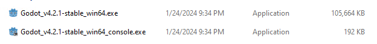

# Fundamentals - Setup

Here we'll make a few initial acknowledgements and prepare to launch the editor for the first time.

## Hardware Limitations

Before we even begin, consider whether the hardware you are using is sufficient for the kind of game you envision. If you want a gorgeous-looking game with 3D graphics, things might not go so well on integrated GPU as you progress in its development. However, it entirely depends on your hardware and what you want to build - this is just something to stay aware of. If you have a beefy computer as-is, this probably doesn't concern you.

Godot is very lightweight and will run on far less capable hardware than Unreal or even Unity, in some cases. This is also evident in its size - **the entire engine (at the time of writing) is just a little over 100MB, packaged into a single exe file**!

## Organization, record-keeping

It is worth acknowledging early on that when you begin to work on projects of ANY kind, you should have them **somewhere safe** that you will remember, and always **keep backups**. Keeping your project on a GitHub repository is a nice way to have it stored on the cloud (private or public), with all the added benefits of robust version control. Read more about that over in the [Git and GitHub Workshop](../../git_and_github_workshop/index.html). *Yes, getting all your little test projects added to version control is excessive* - you don't need to worry about this yet. Just something good to keep in mind for the future and to start learning now if you want to work on more significant projects down the road.

## Download

Godot can be downloaded from its website:

[Godot Engine - Download](https://godotengine.org/download)

The above URL will redirect you to the download page for your specific system - whether that is Windows, macOS, or Linux. *Fun fact: The Godot editor can even be run on Android, and in the web browser!*

**This workshop was developed using Godot 4.2**.

I would recommend you use that version if you plan on following the information available here. Using newer versions **may** be okay, although look out for surprises and/or deprecated features. Using older versions is not recommended. You can download specific Godot versions on the [archive download page](https://godotengine.org/download/archive/).

This workshop will also be using Windows, however most information should carry over smoothly to other platforms.

A .zip file will be downloaded from that page. Go ahead and extract it - the contents should look something like this:

Only two files... huh. Is that right?

**Yep!** As previously stated, the entire Godot editor is a **single executable file**. The second file you see here, suffixed with `_console`, simply runs the editor inside a separate console window so that additional messages or errors, that may not be reported in the editor window itself, can be viewed.

Granted, that is not *everything*. To actually turn your game or project into an executable file others can run, you'll need what are called **export templates**, but we'll talk more about that later.

You may want to put these files somewhere that you'll remember! Once you have it where you want it, go ahead and run the editor (either one is fine, but in order to reduce clutter I'll be launching without the console).

## In Summary

That's about it! There is shockingly little setup involved in getting to the point where you can launch the editor and begin making stuff.

- Ensure your device will be able to handle the kind of projects you want to involve yourself in,
- Download the editor from [https://godotengine.org](https://godotengine.org),
- Extract the .zip file you have downloaded and put the files somewhere safe.